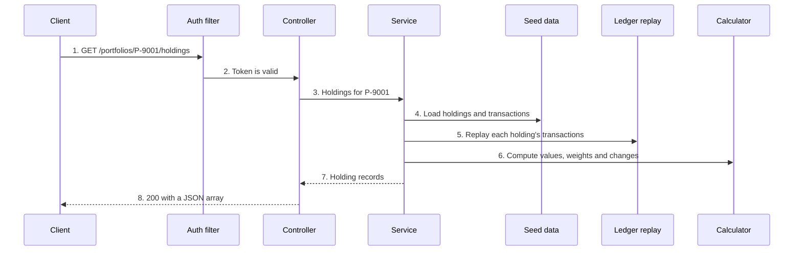
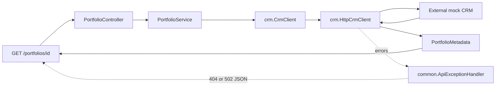
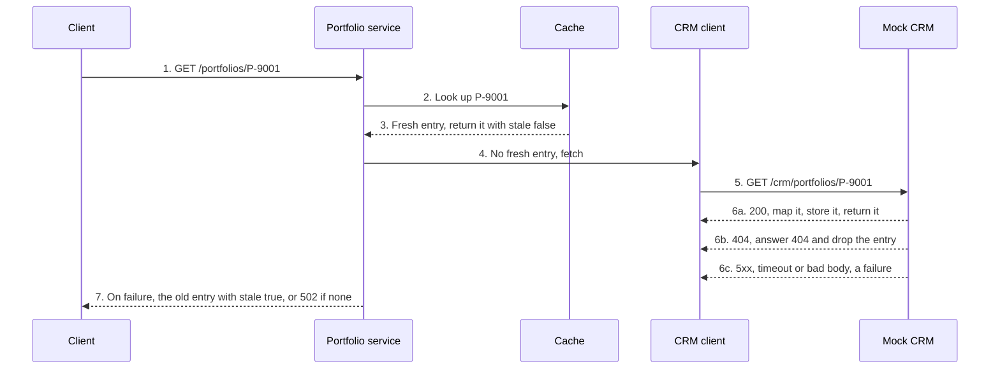
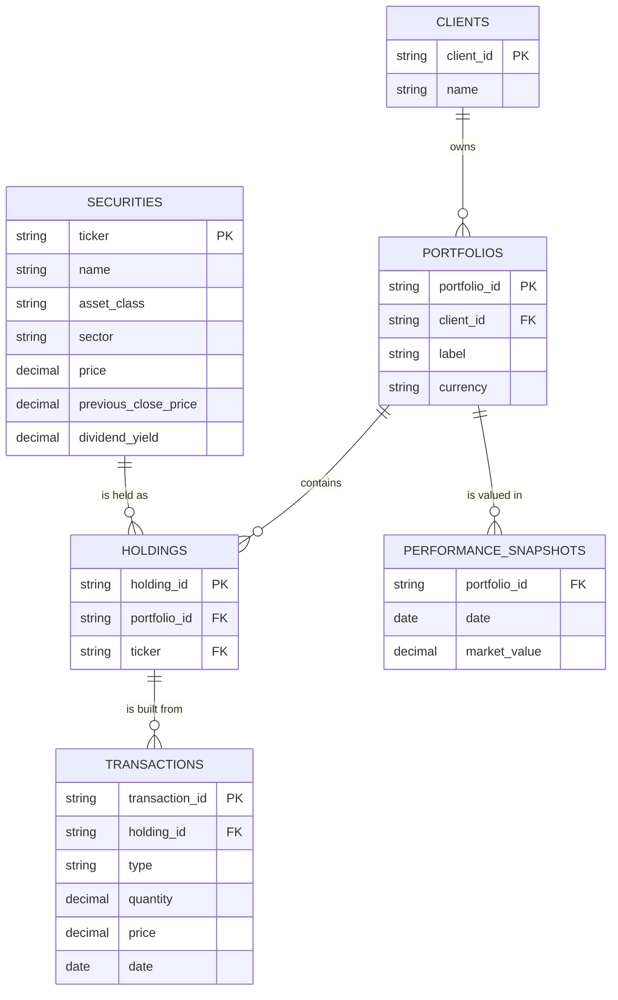

# Architecture

The design for the ten tasks in `requirements.md`. Decisions the spec leaves open are in `assumptions.md` (A-numbers).
Built so far: `crm` and the portfolio metadata endpoint (Task 1); holdings and allocation in `holding` (Tasks 2 and 5); performance history in `history` (Task 3); client portfolios and the household summary in `client` (Task 6); `ledger` (Task 10); and in `common` the auth filter (Task 4), error body, exception handler, UTC clock, rounding and seed loader. Currency (Task 7), holding detail (Task 8) and the CRM cache (Task 9) remain future work.

## 1. Decisions at a glance

| Decision | Choice | Main alternative | Why, and when the alternative wins |
|---|---|---|---|
| Framework | Spring Boot 4.1.1, Java 21, Maven | Node/Express | The skeleton and the rules file exist. No reason to switch. |
| Storage | In memory, loaded at startup from a copy of `seed.json` | SQLite | The spec allows it; no dependency. Use a database when data must survive a restart. |
| Layout | Package by feature, plus `common` | Layer packages | One task touches one package, so two people rarely edit the same file. |
| Errors | Exceptions, mapped by one `@RestControllerAdvice` to `{error, message}` | Per-controller handling | One place fixes the body for 400, 401, 404 and 502 (A2). |
| Time | An injected `Clock` bean in UTC | `LocalDate.now()` | Tests fix and move "today" without sleeping (A5). |
| CRM call | `RestClient` behind an interface; 1 s connect, 2 s read; no retry | Retry on failure | A retry changes the call counts Task 9 checks (A11). Retry is worth it without a cache. |
| Numbers | `BigDecimal`, rounded once at output | `double` | No float drift in money (A3). |
| Port | 3000 | 8080 | `START-HERE.md` and `requests.http` use it. |

## 2. Project structure

```
src/main/java/ca/en/solution
├── common      error body, exception handler, auth filter (Task 4), clock, rounding, currency (Task 7)
├── crm         CRM client interface, HTTP client, mapper to our records (Task 1)
├── portfolio   GET /portfolios/{id} (Task 1) and its cache (Task 9)
├── holding     holdings list and calculations (Task 2), allocation (Task 5), detail by ticker (Task 8)
├── history     performance history and range filter (Task 3)
├── client      client portfolio list and household summary (Task 6)
└── ledger      replay of transactions into quantity and average cost (Task 10)
src/test/java/ca/en/solution   mirrors the packages above
```

Rules:

- Controllers only translate HTTP: parse and validate input, call one service method, return a record.
- Services load data and call calculators. Only services touch stored data and the CRM client.
- Calculations are plain classes: no Spring, no I/O, no clock reads. "Today" is a parameter.
- CRM field names appear only in `crm`.

## 3. How a request flows

`GET /portfolios/P-9001/holdings` (Task 2), behind the auth filter (Task 4). Every step is built.



1. The request arrives with `Authorization: Bearer <token>`.
2. The filter rejects a bad header with 401 before any route logic, on every path (A21, A36). It writes the error body itself, because the exception handler only sees errors raised inside a controller.
3. The controller checks the inputs and calls one service method.
4. The service reads the portfolio; an unknown id throws not-found, which becomes 404.
5. Quantity and average cost come from the transactions, never from stored fields (A17).
6. The calculator applies Task 2's formulas at full precision.
7. Rounding happens once, when the response records are built (A3).
8. Errors on any step leave through the one exception handler.

## 4. External calls

The mock CRM (`http://localhost:4002`, set by `crm.base-url`) is the only external system. Only Task 1 calls it.
Timeouts: 1 s to connect, 2 s to read. No retry. The cache steps arrive with Task 9.

Implemented Task 1 flow:



- `crm.HttpCrmClient` owns private legacy JSON records, normal/nested account
  selection, and translation to `portfolio.PortfolioMetadata`. Decimal fields
  deserialize directly as `BigDecimal` and are rounded once at output (A3).
- Missing values remain null, and all nine public response fields are included.
  `asOf` is the CRM timestamp; Task 1 does not read a clock or persist local data.
- `PortfolioService` receives the `CrmClient` interface through constructor
  injection. The controller calls only the service.
- `common.ApiExceptionHandler` returns `{ error, message }` (`common.ApiError`): 404
  `not_found` for any `common.NotFoundException`, such as an unknown portfolio, or
  502 `crm_unavailable` for an upstream failure. It is the only exception handler.
- Redirects are disabled so every non-2xx CRM response reaches the status handler.
- Task 1 has no authentication, cache, or stale fallback yet. The sequence below
  describes the target once Task 9 is implemented.



- Not found (404): the CRM says 404, or its 200 has no account with that `acct_ref` (A9).
- Failed: timeout, connection error, other non-2xx, a body that is not JSON, no account list (A9).
- Fallback: an expired entry is served with `stale: true`; with nothing cached the answer is 502 (A33).

## 5. Data model

The schema deliverable for Task 10. Today these are in-memory records loaded from the seed; the tables show how they would be stored.



Reasoning:

- `holdings` has no quantity and no cost basis column. Both come from replaying `transactions`, so they cannot drift from the ledger.
- `securities` is our addition to the spec's four tables. Name, asset class and prices belong to the ticker, not to one portfolio: `AAPL` is held in two portfolios with the same price.
- A holding is one ticker in one portfolio, so `(portfolio_id, ticker)` is unique.
- `transactions.type` is `BUY` or `SELL`; quantity is greater than 0 and price is not negative (A35).

| Stored | Computed at request time |
|---|---|
| Clients, portfolios, holdings, transactions | `quantity`, `costBasisPerShare` (ledger replay) |
| Security name, asset class, sector, prices, dividend yield, 52-week range, price history | `marketValue`, `weightPercent`, `unrealizedGainLoss`, `dayChangeAmount`, `dayChangePercent` |
| Daily performance snapshots | Allocation by class, client and household totals, range filtering |
| The CAD to USD rate | Every converted amount |
| Nothing from the CRM, except the Task 9 cache entry | Task 1's response (mapped from the CRM on each call or from the cache) |

## 6. Test strategy

- **Unit:** calculators and the ledger replay, plain JUnit with no Spring. Expected values are literals worked by hand.
- **Web slice:** `@WebMvcTest(TheController.class)` with the service or CRM client faked; checks status codes, error bodies and JSON shape.
- **Full app:** one context-load test, and one happy path per endpoint.
- **Time:** tests build their own fixed `Clock` and move it forward. No test sleeps.
- **CRM:** a fake behind the client interface returns scripted results, errors and timeouts. One test proves a real timeout against a local stub server.
- **Implemented Task 1 tests:** `PortfolioEndpointTests` uses the real Spring app,
  MockMvc and transport against an isolated local HTTP stub. It covers mapping,
  nested/second accounts, null fields, zeros, exact large-decimal rounding,
  malformed responses, 404/502 statuses, redirects, connection refusal, and real
  2-second header/body timeouts. Slow responses use latches, without sleeps.
- **Order under time pressure:** calculations, edge cases, status codes and error bodies, then one happy path per endpoint.

## 7. Growth

| When this grows | Change | Where the seam already is |
|---|---|---|
| Data must survive a restart | Replace the seed loader with a database | Services read through one data class; the schema is in section 5 |
| More than one instance | Move the cache to a shared store | The cache is a small internal interface (Task 9) |
| Live exchange rates | Look the rate up and cache it | Conversion is one class in `common` (A26) |
| Real users | Validate tokens and check client ownership | The auth filter (A1) |
| A second external system | Add a client interface and a mapper beside `crm` | The anti-corruption layer pattern in `crm` |
| Sell lots by FIFO instead of average cost | Replace the replay rule | `ledger` is a pure function with its own tests |

## 8. Known limitations

- **Data is lost on restart.** Acceptable: the seed is reloaded. Next step: a database.
- **One shared token reads every client.** Acceptable: the spec allows a hardcoded token. Next step: per-client authorization (A1).
- **One fixed exchange rate, also for past dates.** Acceptable: the seed supplies one rate. Next step: dated rates (A28).
- **Same-date transactions rely on input order.** Acceptable: dates carry no time. Next step: a timestamp or sequence number on transactions (A35).
- **Stale CRM data has no maximum age.** Acceptable: the spec sets none. Next step: a stale limit (A32).
- **Read timeouts bound inactivity, not total streaming duration.** A stalled
  CRM read times out after 2 seconds; there is no total download deadline.
- **The Windows Maven wrapper fails on a null directory property in this environment.**
  `README.md` documents running the existing cached Maven installation directly.
- **`src/main/resources/seed.json` is a copy of `backend/fixtures/seed.json`.** Acceptable: the app must run on its own. Next step: one source, or a database. Its holdings still carry `quantity` and `costBasisPerShare`; we ignore both and replay the transactions (A17).
- **Only expected 400, 401, 404 and 502 errors use our error body so far.** With a valid token, an unknown route or an unexpected error still gets Spring's default body, without a stack trace.
- **A browser on another origin cannot call the API.** There is no CORS setup, and the auth filter also rejects the browser's preflight `OPTIONS` request. Acceptable: this track is tested with an HTTP client. Next step: CORS configuration that lets `OPTIONS` through.
- **Every web test must send the auth header.** The filter is a `@Component`, so it is active in `@WebMvcTest` slices too. Tests declare the header as a constant.
