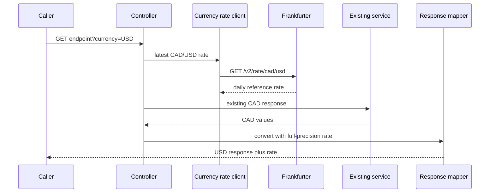

# Task 7: live currency display design

## Intent and scope

Add `?currency=CAD|USD` to the portfolio metadata, holdings, and performance-history endpoints. The user requested a current daily reference rate instead of the fixture's static CAD-to-USD rate. CAD remains the base currency, and omitting the parameter remains equivalent to `currency=CAD`.

The service will use Frankfurter's public `GET /v2/rate/cad/usd` endpoint. It requires no API key and provides the latest published daily reference rate. This replaces the Task 7 draft assumption A26 only; it does not add historical-rate conversion or a cache policy.

## Design

`currency` will be parsed once at each of the three controllers. Exact `CAD` and `USD` are valid. Any other value, including lowercase forms and an empty value, raises `BadRequestException` and returns the existing `400 { error: "bad_request", message }` body.

A small `CurrencyRateClient` interface exposes `BigDecimal cadToUsdRate()`. `FrankfurterCurrencyRateClient` uses Spring's existing HTTP stack to request the one currency pair from a configurable `currency-rate.base-url` defaulting to `https://api.frankfurter.dev`. It applies the existing one-second connect and two-second read timeout values. A missing, malformed, non-positive, or unsuccessful response becomes a `CurrencyRateUnavailableException`, which the shared exception handler maps to `502 { error: "currency_rate_unavailable", message }`.

`CurrencyConverter` is a plain conversion helper. It returns a response context containing the requested currency and exchange rate: CAD uses rate `1`; USD gets the client rate. It multiplies full-precision monetary values and applies the existing half-up response rounding only afterwards. `null` stays `null`; quantities, percentage fields, dates, identifiers, labels, and names are unchanged.

Each endpoint gets a Task 7 response type that adds `currency` and `exchangeRate`: one top-level object for portfolio metadata and one field pair on every holdings or history array element. The existing Task 2 and Task 3 calculation services retain their CAD/full-precision responsibilities. The Task 7 mapper converts their values at the HTTP boundary, so allocation and other endpoints remain CAD-only under their current contracts.

## Data flow

## Tests and documentation

Unit tests will cover converter rounding and `null` preservation. Controller/integration tests will replace the rate client with a deterministic fake rate of `0.73`; they will verify CAD defaults, USD monetary conversions, unchanged non-monetary fields, exact invalid-currency 400 responses, and currency-service 502 responses for all three routes. Existing Task 1 tests will be updated for the added fields and fake client.

`assumptions.md`, `architecture.md`, and `README.md` will document Frankfurter, its daily-reference freshness, the endpoint's configuration property, and the failure behavior. No new library dependency is needed.
